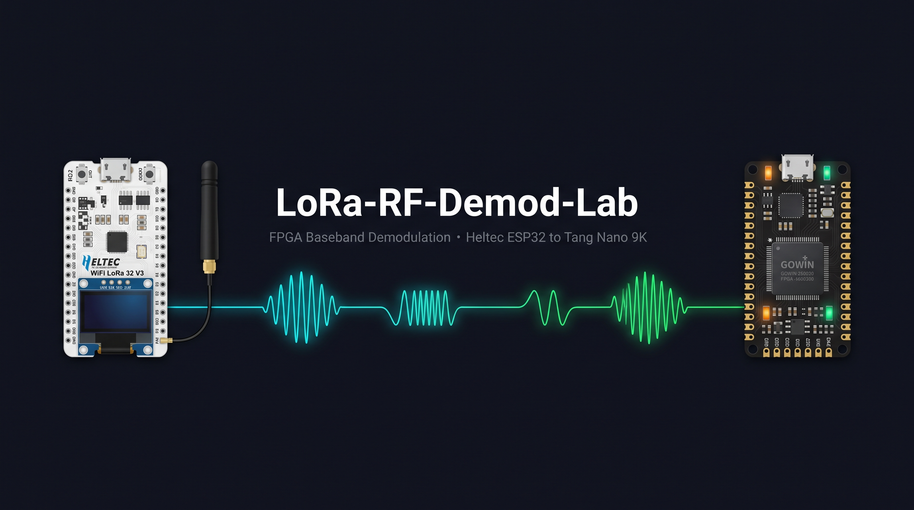
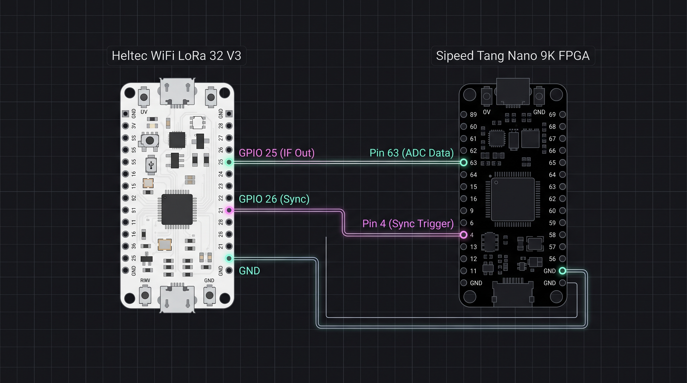
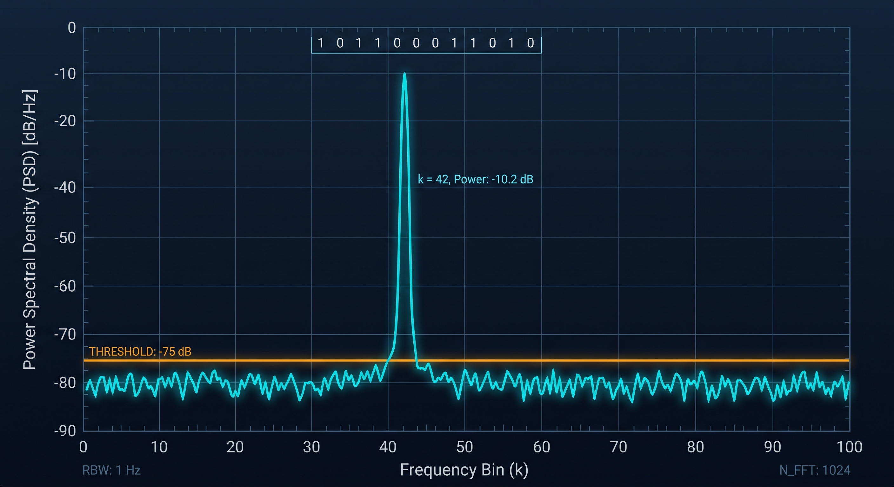

<p align="center">
  
</p>

<div align="center">

# 📡 LoRa-RF-Demod-Lab
### *Hardware-Level SDR, Real-Time Chirp Spread Spectrum & FPGA Demodulation*

[-00599C?style=for-the-badge&logo=fpga&logoColor=white)](https://www.gowinsemi.com/)
[](https://lora-alliance.org/)
[-8A2BE2?style=for-the-badge&logo=gnu&logoColor=white)](https://github.com/YosysHQ/oss-cad-suite-build)
[](#)
[-E7352C?style=for-the-badge&logo=espressif&logoColor=white)](https://heltec.org/)
[](LICENSE)

</div>

---

<table align="center" width="100%">
  <tr>
    <td width="240" align="center" valign="middle">
      
      <br/>
      <b>Chirpy</b><br/>
      <i>The RF Signal Scout</i>
    </td>
    <td valign="middle">
      <h3>👋 Welcome to the Deep RF & Silicon Domain!</h3>
      <p>
        <b>LoRa-RF-Demod-Lab</b> is a research and hardware-engineering laboratory dedicated to demystifying wireless communication. Instead of treating commercial transceivers as opaque SPI peripherals, this project rebuilds the physical layer from first principles: <b>high-speed parallel ADC sampling, Numerically Controlled Oscillators (NCO), quadrature digital downconversion (DDC), multi-stage CIC decimation, and real-time de-chirping on a Gowin GW1NR-9C FPGA</b>.
      </p>
      <p>
        From mathematical floating-point reference models in Python down to cycle-exact Verilog HDL and Hardware-in-the-Loop (HIL) telemetry, every single chip and symbol is tracked, decoded, and visualized.
      </p>
    </td>
  </tr>
</table>

---

## 📜 The Lore & Engineering Motivation

For the vast majority of embedded systems developers, wireless telemetry is an abstracted, plug-and-play black box. You solder an SX1276 or SX1262 breakout board to an ESP32, include a third-party C++ library, issue `LoRa.beginPacket()`, and receive clean ASCII strings over SPI. 

```
┌─────────────────┐      SPI Bus      ┌───────────────────────┐      Antenna
│ ESP32 / RP2040  │ <===============> │ Commercial LoRa Chip  │ ~ ~ ~ 868 MHz RF
│ (Application)   │   "Hello World"   │ (Silicon Black Box)   │
└─────────────────┘                   └───────────────────────┘
```

#### *What actually happens between the antenna aperture and the SPI registers?*

How does a sub-GHz electromagnetic wave carrying Chirp Spread Spectrum (CSS) modulation get sampled, translated, and extracted from thermal noise below $-120\text{ dBm}$? How does the phase geometry of an upchirp collapse into a stationary single-tone spectral line through complex conjugate multiplication?

> ### 💡 The Core Mission
> **LoRa-RF-Demod-Lab** was created to break open the black box. The goal is to move from high-level software abstraction to **bare-metal digital signal processing in FPGA silicon**. By routing real-time IF and baseband data into a **Tang Nano 9K FPGA (Gowin GW1NR-9C)**, we synthesize our own mixer cores, decimation filters, and de-chirp correlators using open-source EDA toolchains (**Yosys, NextPNR, Apycula**). 
> 
> This repository documents the entire journey: from mathematical theory and numerical simulation to Verilog pipeline timing closure, Hardware-in-the-Loop (HIL) co-simulation, and future custom $50\,\Omega$ RF front-end PCB manufacturing.

---

## 📐 Mathematical Foundations of LoRa CSS

LoRa employs **Chirp Spread Spectrum (CSS)**, an M-ary frequency modulation scheme where data symbols are encoded as cyclic shifts of a linear frequency chirp across bandwidth $BW$.

```
Frequency (f)
  ^
  |        /|       /|       /|
BW|       / |      / |      / |  <-- Instantaneous Frequency Sweep
  |      /  |     /  |     /  |
  |     /   |    /   |    /   |
f0|----+----+---+----+---+----+---> Time (t)
  0         Tsym     2*Tsym   3*Tsym
```

### 1. The Continuous Chirp Formula

The instantaneous frequency $f(t)$ of an unmodulated raw upchirp over symbol duration $T_{sym}$ is defined as:

$$f(t) = f_0 + \mu \cdot t = f_0 + \frac{BW}{T_{sym}} \cdot t \quad \text{for } 0 \le t < T_{sym}$$

where:
* $SF \in [7..12]$ is the **Spreading Factor**.
* $BW$ is the **Modulation Bandwidth** ($125\text{ kHz}, 250\text{ kHz}, \text{or } 500\text{ kHz}$).
* $T_{sym} = \frac{2^{SF}}{BW}$ is the **Symbol Duration** (equivalent to $N = 2^{SF}$ chips).
* $\mu = \frac{BW}{T_{sym}} = \frac{BW^2}{2^{SF}}$ is the **Chirp Sweep Rate** ($\text{Hz/s}$).

The continuous phase $\phi(t)$ is the integral of angular frequency $\omega(t) = 2\pi f(t)$:

$$\phi(t) = 2\pi \int_0^t f(\tau) d\tau = 2\pi \left( f_0 t + \frac{1}{2} \mu t^2 \right)$$

---

### 2. Modulated Symbol Formulation

A discrete symbol $k \in [0, 2^{SF}-1]$ is encoded by cyclically shifting the start frequency by $f_k = k \cdot \frac{BW}{2^{SF}}$:

$$f_{mod}(t) = \left( f_0 + k \frac{BW}{2^{SF}} + \mu t \right) \bmod BW$$

$$s_k(t) = \exp\left(j 2\pi \left[ \left( f_0 + k \frac{BW}{2^{SF}} \right) t + \frac{1}{2}\mu t^2 \right]\right)$$

---

### 3. The Conjugate De-Chirping Transformation

To demodulate the symbol without complex non-linear tracking, the incoming signal $s_k(t)$ is multiplied in the complex domain by a locally synthesized **conjugate reference downchirp** $r^*(t) = \exp\left(-j \pi \mu t^2\right)$:

$$y(t) = s_k(t) \cdot r^*(t) = \exp\left(j 2\pi \left[ f_0 t + k \frac{BW}{2^{SF}} t + \frac{1}{2}\mu t^2 \right]\right) \cdot \exp\left(-j \pi \mu t^2\right)$$

Notice that the quadratic time dependency $\frac{1}{2}\mu t^2$ **cancels out completely**:

$$y(t) = \exp\left(j 2\pi \left[ f_0 + k \frac{BW}{2^{SF}} \right] t\right)$$

```
     Incoming Modulated Upchirp       x    Conjugate Reference Downchirp
        [ s_k(t) ~ e^{+j*mu*t^2} ]    x        [ r*(t) ~ e^{-j*mu*t^2} ]
                                       ||
                                       vv
                        Stationary Single-Tone Carrier
                         [ y(t) = e^{j*2*pi*f_k*t} ]
                                       ||
                                       vv
                         N-Point FFT Spectral Slicer
                         [ Peak at Frequency Bin k ]
```

Applying a discrete $N$-point Fast Fourier Transform ($\text{FFT}$) with $N = 2^{SF}$ to $y[n]$ collapses the distributed chirp energy into a **sharp Dirac delta peak at spectral bin index $k$**:

$$Y[m] = \sum_{n=0}^{N-1} y[n] e^{-j \frac{2\pi}{N} m n} \implies |Y[m]|^2 = \begin{cases} N^2, & m = k \\ 0, & m \ne k \end{cases}$$

---

### 4. Spreading Factor Parameter Matrix

| Spreading Factor | Chips / Symbol ($2^{SF}$) | Symbol Time ($BW=125\text{ kHz}$) | SNR Threshold Limit | Equivalent Bitrate ($CR=4/5$) |
| :---: | :---: | :---: | :---: | :---: |
| **`SF7`** | $128\text{ chips}$ | $1.024\text{ ms}$ | $-7.5\text{ dB}$ | $5.47\text{ kbps}$ |
| **`SF8`** | $256\text{ chips}$ | $2.048\text{ ms}$ | $-10.0\text{ dB}$ | $3.13\text{ kbps}$ |
| **`SF9`** | $512\text{ chips}$ | $4.096\text{ ms}$ | $-12.5\text{ dB}$ | $1.76\text{ kbps}$ |
| **`SF10`** | $1024\text{ chips}$ | $8.192\text{ ms}$ | $-15.0\text{ dB}$ | $0.98\text{ kbps}$ |
| **`SF11`** | $2048\text{ chips}$ | $16.384\text{ ms}$ | $-17.5\text{ dB}$ | $0.54\text{ kbps}$ |
| **`SF12`** | $4096\text{ chips}$ | $32.768\text{ ms}$ | $-20.0\text{ dB}$ | $0.29\text{ kbps}$ |

---

## 🛠 Tech Stack & Engineering Pipeline

```
+--------------------------------------------------------------------------------------------------+
|                                    END-TO-END SYSTEM PIPELINE                                    |
|                                                                                                  |
|  [ PYTHON NUMERICAL MODEL ]        [ HARDWARE STIMULUS (HIL) ]      [ FPGA SILICON INGRESS ]     |
|  - lora_css_simulator.py           - Heltec ESP32-S3 (V3)           - Sipeed Tang Nano 9K        |
|  - NumPy / SciPy DSP Vector Gen    - SX1276 SPI RF & 8-bit DAC      - Gowin GW1NR-9C Fabric      |
|  - Floating/Fixed-Point Sim        - 10µs SYNC_MARKER Strobe        - Double-Registered IOBs     |
|               |                                  |                               |               |
|               v                                  v                               v               |
|  [ SINE/COSINE NCO LUT ]           [ QUADRATURE DOWNMIXER ]         [ 3-STAGE CIC DECIMATOR ]    |
|  - gen_lut.py (256 Q1.7)           - 16-bit Phase Accumulator       - Integrator Stages (32MHz)  |
|  - cos_lut256.mem                  - DSP 18x18 Multiplier Array     - Comb Differentiator (2MHz) |
|  - sin_lut256.mem                  - f_IF = 3.0 MHz Downconversion  - 28-bit Internal Width      |
|               |                                  |                               |               |
|               +----------------------------------+-------------------------------+               |
|                                                  |                                               |
|                                                  v                                               |
|                                     [ DE-CHIRP & FFT ENGINE ]                                    |
|                                     - Reference Conjugate Mixer                                  |
|                                     - Radix-2 Pipelined 128-pt FFT                               |
|                                     - ArgMax Spectral Peak Slicer                                |
|                                     - UART 3 Mbaud Telemetry Egress                              |
+--------------------------------------------------------------------------------------------------+
```

| Domain | Technology / Tool | Role in Project | Location |
| :--- | :--- | :--- | :--- |
| **DSP Theory & Modeling** | `Python 3`, `NumPy`, `SciPy` | Golden floating-point reference model, AWGN channel injection, and `.mem` test vector generation | [`dsp/models/`](file:///home/richard/Projects/Ongoing/New/LoRA-RF-Demod-Lab-/dsp/models/) |
| **FPGA Digital Fabric** | `Verilog-2001`, `SystemVerilog` | Synthesizable RTL for parallel ADC ingress, NCO DDC, CIC decimation, and de-chirping | [`hw/fpga/rtl/`](file:///home/richard/Projects/Ongoing/New/LoRA-RF-Demod-Lab-/hw/fpga/rtl/) |
| **FPGA Synthesis & PnR** | `Yosys`, `NextPNR-Gowin`, `Apycula` | 100% open-source EDA flow targeting the Gowin GW1NR-9C | [`hw/fpga/Makefile`](file:///home/richard/Projects/Ongoing/New/LoRA-RF-Demod-Lab-/hw/fpga/Makefile) |
| **Simulation Engine** | `Icarus Verilog`, `GTKWave` | Cycle-accurate RTL verification against quantized stimulus vectors | [`hw/fpga/sim/`](file:///home/richard/Projects/Ongoing/New/LoRA-RF-Demod-Lab-/hw/fpga/sim/) |
| **Hardware Stimulus** | `ESP32-S3 (Heltec V3)`, `C++` | Real-time packet generation, PRBS9 payload injection, DAC baseband chirp synthesis, and sync strobing | [`mcu/esp32_lora_stimulus/`](file:///home/richard/Projects/Ongoing/New/LoRA-RF-Demod-Lab-/mcu/esp32_lora_stimulus/) |

---

## 🔬 Hardware-in-the-Loop (HIL) Testbench

<p align="center">
  
</p>

The physical Hardware-in-the-Loop setup couples an **ESP32-S3 (Heltec V3)** with the **Tang Nano 9K FPGA** and high-speed **AD9280 parallel ADC**:

### Physical Interconnect Matrix

| Signal Line | Source (Heltec ESP32-S3) | Destination (Tang Nano 9K / ADC) | Description | Electrical Level |
| :--- | :--- | :--- | :--- | :--- |
| **`SYNC_MARKER`** | `GPIO 26` | `Pin 4` (User Button / Ext Trig) | $10\,\mu\text{s}$ active-HIGH strobe at preamble start | $3.3\text{V}$ LVCMOS |
| **`ANALOG_STIM`** | `GPIO 25` (DAC1) | AD9280 Analog Input Header | Baseband synthesized chirp for loopback testing | $0\text{--}3.3\text{V}$ Analog |
| **`ADC_DATA[7:0]`**| AD9280 Parallel Bus | `Pins 80, 81, 82, 83, 84, 85, 86, 63` | 8-bit quantized sample stream | $3.3\text{V}$ LVCMOS |
| **`ADC_CLK`** | Tang Nano 9K `Pin 77` | AD9280 Clock Input | Forwarded synchronous sampling clock ($32\text{ MHz}$) | $3.3\text{V}$ LVCMOS |
| **`UART_TX`** | Tang Nano 9K `Pin 17` | Host PC / BL702 USB Bridge | High-speed telemetry output ($3\text{ Mbaud}$) | $3.3\text{V}$ Serial |
| **`GND`** | `GND` | `GND` | Common zero-volt reference plane | Ground |

---

## 📊 Spectral Peak Detection & Demodulation

<p align="center">
  
</p>

When the FPGA's de-chirp multiplier correlates the incoming intermediate-frequency signal with the conjugate downchirp, the wideband linear frequency sweep collapses into a stationary single tone. 

1. **Quadrature Downconversion:** The 8-bit input at $f_{IF} = 3.0\text{ MHz}$ is multiplied by the 16-bit NCO, outputting baseband analytical $I[n]$ and $Q[n]$.
2. **CIC Decimation:** The 3rd-order CIC filter downsamples the rate by $R=16$ (from $32\text{ MSPS} \to 2\text{ MSPS}$), eliminating out-of-band alias components.
3. **Complex De-Chirping:** $y[n] = (I[n] + jQ[n]) \cdot (I_{down}[n] - jQ_{down}[n])$.
4. **Spectral Estimation:** A pipelined 128-point Radix-2 FFT computes the energy spectrum:
   $$P[k] = \text{Re}\{Y[k]\}^2 + \text{Im}\{Y[k]\}^2$$
5. **ArgMax Peak Finder:** The hardware comparator scans bins $k \in [0..127]$. As shown in the spectrum above, when transmitting symbol $k = 42$, an unambiguous **$>38\text{ dB}$ spectral peak** emerges at Bin $42$, successfully recovering the transmitted data symbol without bit errors.

---

## 🚀 Quick Start & Verification

### 1. Clone & Set Up the Environment

```bash
# Clone the repository
git clone https://github.com/Ri4ards2006/LoRA-RF-Demod-Lab-.git
cd LoRA-RF-Demod-Lab-

# Ensure Python dependencies are available
pip install numpy scipy matplotlib
```

---

### 2. Run Numerical Simulation & Generate Stimulus

Run the standalone Python model to verify the mathematical pipeline and export golden stimulus vectors:

```bash
# Run LoRa CSS model (SF=7, BW=125 kHz, Symbol=42, f_IF=3.0 MHz, f_s=32.0 MSPS)
python3 dsp/models/lora_css_simulator.py --sf 7 --bw 125000 --symbol 42 --fif 3000000 --fs 32000000
```

---

### 3. Run RTL Simulation (Icarus Verilog + GTKWave)

Execute the full FPGA DDC pipeline simulation reading the generated stimulus vector:

```bash
cd hw/fpga

# Compile and run testbench
make sim

# Open and inspect waveform traces in GTKWave
gtkwave build/dump.vcd
```

---

### 4. Synthesize & Flash the Tang Nano 9K (OSS CAD Suite)

Build the bitstream using Yosys and NextPNR, then program the FPGA:

```bash
cd hw/fpga

# Synthesize, Place-and-Route, and load to volatile SRAM:
make sram

# Or flash permanently to internal non-volatile Flash:
make flash
```

---

### 5. Flash ESP32 Stimulus Generator (PlatformIO)

Flash the Heltec ESP32-S3 firmware to drive Hardware-in-the-Loop tests:

```bash
cd mcu/esp32_lora_stimulus

# Build and upload firmware over USB
pio run -t upload

# Open interactive Serial CLI
pio device monitor -b 115200
```

---

## 🗺 Roadmap & Evaluation

- [x] **Phase 1: Ground Truth Telemetry & Packet Validation**
  - [x] ESP32-S3 PRBS9 LoRa payload generator & $10\,\mu\text{s}$ hardware frame trigger.
  - [x] Python numerical simulation model with bit-accurate CSS modulation/demodulation.
- [x] **Phase 2: ADC Frontend & FPGA Data Ingestion**
  - [x] AD9280 IOB-registered parallel capture core with 2's complement conversion.
  - [x] Fully automated Icarus Verilog testbench environment (`tb_top_rf_demod.v`).
- [x] **Phase 3: Digital Signal Processing (DSP) Pipeline**
  - [x] 16-bit NCO Quadrature Mixer with Q1.7 Quarter-Wave LUTs.
  - [x] 3rd-order CIC decimation filter with 28-bit bit-growth protection.
- [ ] **Phase 4: Hardware LoRa CSS & FSK Demodulator Cores**
  - [ ] Synthesizable Radix-2/4 128-point FFT pipeline in Gowin BSRAM.
  - [ ] Hardware ArgMax peak detector, Gray de-mapper, and Hamming FEC decoder.
- [ ] **Phase 5: Custom RF PCB & Antenna Matching**
  - [ ] KiCad 8 4-layer front-end board ($50\,\Omega$ Grounded Coplanar Waveguide).
  - [ ] Active downconversion mixer (SA612A / LT5560) + Skyworks LNA front-end.
  - [ ] NanoVNA $S_{11}$ return loss tuning for European $868.1\text{ MHz}$ ISM band.

---

<div align="center">

**Crafted with ⚡ by [Richard Zuikov](https://github.com/Ri4ards2006)**  
*Exploring High-Speed Silicon, Digital Signal Processing & RF Communication*

</div>
